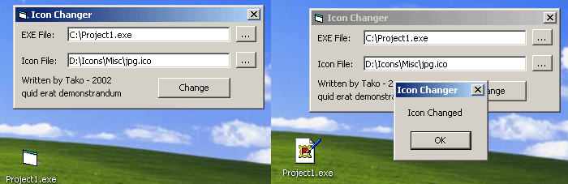



## Change Icon in compiled EXE

### Description

This will mod PE headers of compiled EXEs to change their icons.
 
### More Info
 

             |
---                |---
**Submitted On**   |2005-04-12 14:47:14
**By**             |[Kevin Smithwick](https://github.com/Planet-Source-Code/PSCIndex/blob/master/ByAuthor/kevin-smithwick.md)
**Level**          |Intermediate
**User Rating**    |4.8 (81 globes from 17 users)
**Compatibility**  |VB 4\.0 \(32\-bit\), VB 5\.0, VB 6\.0
**Category**       |[Files/ File Controls/ Input/ Output](https://github.com/Planet-Source-Code/PSCIndex/blob/master/ByCategory/files-file-controls-input-output__1-3.md)
**World**          |[Visual Basic](https://github.com/Planet-Source-Code/PSCIndex/blob/master/ByWorld/visual-basic.md)
**Archive File**   |[Change\_Ico1875954122005\.zip](https://github.com/Planet-Source-Code/kevin-smithwick-change-icon-in-compiled-exe__1-59973/archive/master.zip)

